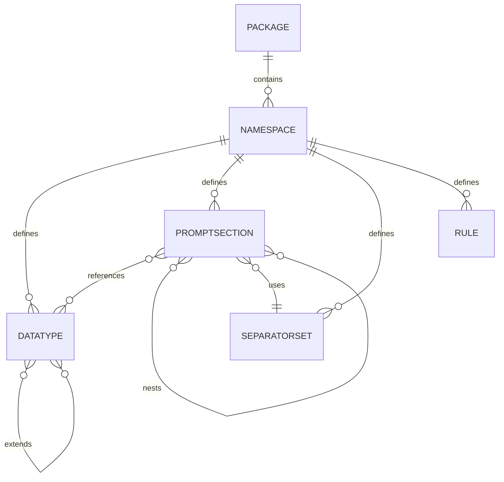

# RPG Architecture & Data Model

**Version:** 1.0.0  
**Last Updated:** 2025-12-17

This document describes the core components and data model of the Random Prompt Generator (RPG) specification. It provides the technical foundation for understanding how packages are structured and how the system works.

**For a high-level overview:** See [Architecture Overview](./overview.md)  
**For learning the system:** See [Tutorial Series](../guides/tutorial-series/)

---

## System Components (v1.0.0)

### Authoring Tool

**Purpose:** Create and edit packages visually or via text

**Capabilities (v1.0.0):**
- Visual editors for all component types
- Real-time validation with error/warning display
- Live preview with batch generation
- Package loading and saving (YAML)
- Jump-to-error navigation

**Implementation Status:** ✅ Complete (M7)  
**Availability:** Q1 2026 (standalone release)

**Learn more:** [Getting Started](../guides/getting-started.md)

---

### Package Validator

**Purpose:** Ensure packages are valid and deterministic

**Capabilities (v1.0.0):**
- Schema validation (YAML structure)
- Semantic validation (references exist, no circular dependencies)
- Helpful error messages with suggestions
- Warning system for non-blocking issues
- Location information for errors

**Implementation Status:** ✅ Complete (M6)  
**Test Coverage:** 17 tests, 9 error types

**Error Types Detected:**
1. Missing fields (id, version, metadata)
2. Invalid references (namespace:component not found)
3. Circular dependencies (A → B → A)
4. Self-references (without matching datatype)
5. Empty/invalid structures
6. Unused references (warning)
7. Template/reference mismatches
8. Invalid tag expressions
9. Min/max constraint violations

---

### Rendering Engine

**Purpose:** Execute templates and generate deterministic output

**Capabilities (v1.0.0):**
- Three-phase rendering pipeline
- Deterministic seeded RNG
- Tag filtering with logical expressions
- Context system for coordination
- Nested template support (10 levels)
- List generation with separators
- Min/max multiplicity
- Unique constraint

**Implementation Status:** ✅ Complete (M3-M5)  
**Test Coverage:** Comprehensive (40+ tests)

**Rendering Pipeline:**
1. **Selection Phase:** Parse template, select values from datatypes
2. **Enrichment Phase:** Execute rules, populate context
3. **Rendering Phase:** Replace placeholders, apply separators

**Learn more:** [Template Syntax](./template-syntax.md)

---

### CLI Tool

**Purpose:** Command-line interface for package operations

**Commands (v1.0.0):**
```bash
rpg validate <package.yaml>         # Validate package
rpg render <package.yaml> <section> # Render promptsection
rpg info <package.yaml>             # Show package info
```

**Implementation Status:** ✅ Complete (M6)  
**Availability:** Q1 2026 (with desktop app)

---

## Core Data Model

All components are defined in YAML and organized into packages.

### Package

**Top-level container** for all content.

```yaml
id: my.package
version: 1.0.0
metadata:
  name: Package Name
  description: Package description
  authors: ["Author Name"]
  bypass_filters: false
namespaces: {}
dependencies: []
```

**Required Fields:**
- `id` - Unique identifier (reverse domain notation)
- `version` - Semantic version (major.minor.patch)
- `metadata` - Package information
- `namespaces` - At least one namespace
- `dependencies` - Array (can be empty)

**Learn more:** [Tutorial 1](../guides/tutorial-series/01-basic-package.md)

---

### Namespace

**Logical grouping** for related components.

```yaml
namespaces:
  fantasy:
    id: fantasy
    datatypes: {}
    prompt_sections: {}
    separator_sets: {}
    rules: []
    decisions: []
```

**Contains:**
- `datatypes` - Value lists
- `prompt_sections` - Templates
- `separator_sets` - List formatters
- `rules` - Context coordination
- `decisions` - Future (not in v1.0.0)

**Purpose:** Organization and naming conflict prevention

---

### Datatype

**List of weighted values** with optional tags.

```yaml
creatures:
  name: creatures
  values:
    - text: swan
      weight: 1
      tags:
        can_fly: true
        article: a
    - text: eagle
      weight: 1
      tags:
        can_fly: true
        article: an
  extends: null
  override_tags: {}
```

**Fields:**
- `name` - Datatype identifier
- `values` - Array of value objects
  - `text` - The actual value
  - `weight` - Selection probability (default: 1)
  - `tags` - Key-value properties for filtering/coordination
- `extends` - Inherit from another datatype (optional)
- `override_tags` - Modify inherited tags (optional)

**Uses:**
- Simple lists (colors, adjectives, nouns)
- Tagged lists (filterable by properties)
- Weighted lists (some values more common)
- Extensible lists (build on other datatypes)

**Learn more:** [Tutorial 2: Tag Filtering](../guides/tutorial-series/02-tag-filtering.md)

---

### PromptSection

**Template** that combines datatypes.

```yaml
scene:
  name: scene
  template: "{article} {creature} {action}"
  references:
    article:
      target: context:article
      min: 1
      max: 1
      separator: null
      unique: false
      filter: null
    creature:
      target: fantasy:creatures
      min: 1
      max: 1
      separator: null
      unique: false
      filter: null
    action:
      target: fantasy:actions
      min: 1
      max: 1
      separator: null
      unique: false
      filter: null
```

**Fields:**
- `name` - PromptSection identifier
- `template` - String with `{placeholder}` syntax
- `references` - Map of placeholder definitions
  - `target` - What to pull from (`namespace:datatype` or `context:key`)
  - `min` - Minimum values to select
  - `max` - Maximum values to select
  - `separator` - SeparatorSet name for lists (optional)
  - `unique` - Prevent duplicates (true/false)
  - `filter` - Tag filter expression (optional)

**Features:**
- References to datatypes or context
- Nested references to other promptsections
- Inline tag filtering: `{ref#{expression}}`
- Inline parameters: `{ref?min=2,max=4,sep=comma_and}`

**Learn more:** [Tutorial 1](../guides/tutorial-series/01-basic-package.md), [Tutorial 4](../guides/tutorial-series/04-lists-separators.md)

---

### SeparatorSet

**Defines how to format lists** naturally.

```yaml
comma_and:
  name: comma_and
  two: "{0} and {1}"
  start: "{0}, "
  middle: "{0}, "
  end: "{0} and {1}"
```

**Fields:**
- `name` - SeparatorSet identifier
- `two` - Format for exactly 2 items
- `start` - Format for first item in longer list
- `middle` - Format for middle items
- `end` - Format for last item

**Placeholders:**
- `{0}` - Current item
- `{1}` - Next item (used in `two` and `end`)

**Example:**
```
Input: ["red", "blue", "green"]
Output: "red, blue and green"
         ↑start  ↑middle ↑end
```

**Learn more:** [Tutorial 4: Lists and Separators](../guides/tutorial-series/04-lists-separators.md)

---

### Rules

**Coordinate between template elements** using context.

```yaml
rules:
  - set: article
    from: ref:creature.tags.article
```

**Fields:**
- `set` - Context key to write to
- `from` - Expression to read from
  - `ref:name` - Reference to selected value
  - `ref:name.tags.property` - Tag from selected value
  - `first_selected([ref:a, ref:b])` - First non-null value

**Execution:**
- Rules execute in order during Enrichment phase
- Run after Selection, before Rendering
- Can read from references (selected values)
- Write to context for template use

**Common patterns:**
- Article selection: `first_selected([ref:adj, ref:noun]).tags.article`
- Property sharing: `ref:creature.tags.habitat`

**Learn more:** [Tutorial 3: Context Rules](../guides/tutorial-series/03-context-rules.md)

---

## Data Relationships (v1.0.0)



**Notes:**
- PromptSections can reference other PromptSections (nesting)
- Datatypes can extend other datatypes (inheritance)
- Rules read from references, write to context
- SeparatorSets are referenced by name in PromptSections

---

## Features Not in v1.0.0

### Rulebooks (v1.1.0+)

Wrapper around entry promptsections with weighted selection.

**Planned capabilities:**
- Multiple entry points
- Weighted selection between entries
- Batch configuration
- Context initialization

**Status:** Deferred - basic promptsections sufficient for v1.0.0

---

### Decisions (Future)

Advanced context operations for complex logic.

**Status:** Deferred - rules handle most coordination needs

---

### Pools (Future)

Fragment aggregation for cross-template reuse.

**Status:** Deferred - nested templates cover most use cases

---

### Morphers (Future)

Value transformations (pluralization, case conversion).

**Status:** Deferred - tag-based solutions work for v1.0.0

---

### ContextInterface (Future)

Formal contracts for context keys and contributions.

**Status:** Simplified in v1.0.0 - context is simple key-value store

---

### Marketplace (Future)

Package distribution and discovery.

**Status:** Planned for post-v1.0.0

---

## Serialization (v1.0.0)

**Format:** YAML (canonical)

**Conventions:**
- Identifiers use reverse domain notation: `com.example.mypackage`
- References use `namespace:component` format
- Context references use `context:keyname` format
- All required fields must be present
- Empty collections use `{}` or `[]`

**Example reference formats:**
```yaml
# Datatype reference
target: fantasy:creatures

# Context reference
target: context:article

# Nested promptsection reference
target: fantasy:greeting
```

---

## Determinism Guarantees

**v1.0.0 guarantees:**
- Same seed + same package = same output (always)
- Seeded RNG produces reproducible sequences
- Rules execute in defined order
- Selection is deterministic
- No external randomness

**Not guaranteed:**
- Specific random value for specific seed (implementation detail)
- Exact performance characteristics
- Internal data structures

---

## Validation Rules (Summary)

**Required validations:**
1. Package has id, version, metadata, namespaces
2. All references point to existing targets
3. No circular dependencies
4. Template placeholders match reference names
5. Tag expressions are syntactically valid
6. Min ≤ max for references
7. SeparatorSet names exist when used

**Warning validations:**
1. Unused references (defined but not in template)
2. Empty datatypes
3. Duplicate values (same text)

**Learn more:** See validator implementation in M6

---

## Cross-References

**For users:**
- [Getting Started](../guides/getting-started.md) - Learn the basics
- [Tutorial Series](../guides/tutorial-series/) - Step-by-step learning
- [Template Syntax](./template-syntax.md) - Complete syntax reference

**For implementers:**
- [Architecture Overview](./overview.md) - System design
- [Context Interactions](./context-interactions.md) - Rules and coordination
- [Tag Filtering](./tag-filtering.md) - Selection by properties
- [Source of Truth](../../source-of-truth/) - Design documents

---

**This specification reflects the v1.0.0 implementation from M1-M7.**
